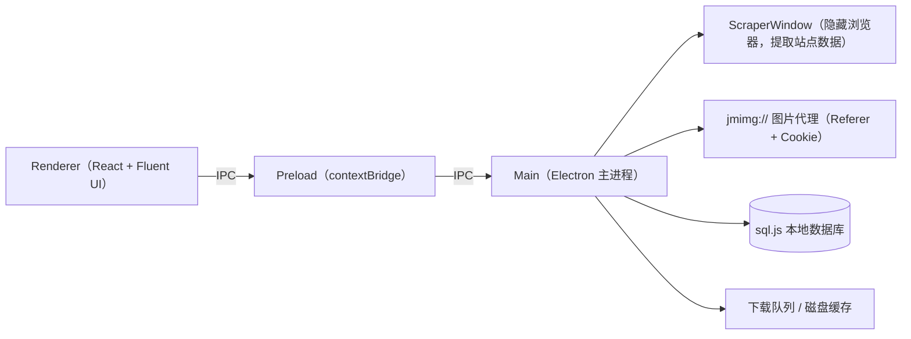

<p align="center">
  
</p>

<h1 align="center">JMComic Desktop</h1>

<p align="center">
  <strong>禁漫天堂（18comic.vip）Windows 桌面客户端</strong><br/>
  WinUI 3 风格 · 原生渲染 · 便携单文件
</p>

<p align="center">
  
  
  
  
  
  
</p>

---

## ✨ 特性

- **原生渲染，绝不内嵌网页**：内容在主进程通过隐藏 BrowserWindow 提取，经 IPC 传结构化数据给 React + Fluent UI 原生渲染，不展示网站原始页面。
- **WinUI 3 设计语言**：无边框窗口 + Mica 云母材质 + 自定义标题栏 + Fluent UI v9，贴合 Windows 11 原生质感。
- **流畅的浏览体验**：首页三 Tab 流式渐进加载（卡片一批批出现）、搜索历史持久化、车号直跳、分类多维筛选、详情页标签反查。
- **沉浸式阅读器**：滚动 / 单页双模式、DOM 虚拟化、键盘翻页、图片缩放、站点图片反打乱还原。
- **下载与离线阅读**：下载队列管理、失败一键重试、打开所在文件夹、本地离线阅读。
- **本地数据优先**：sql.js（SQLite/WASM）持久化，便携单文件运行，数据导出 / 导入 / 清除。
- **网络自适应**：多域名连通性探测、系统代理自动识别、Cloudflare 会话预热、自定义图片代理协议（`jmimg://`）。
- **隐私友好**：浏览记录、收藏、下载状态全部只存本机，不上传任何个人数据。

> [!NOTE]
> 本项目仅供成年人于合法合规场景下进行技术学习与研究。请遵守所在地法律法规。

---

## 🚀 快速开始

### 直接使用

从 [Releases](../../releases/latest) 下载 `JMComic Desktop Portable <版本>.exe`，双击即用 —— 免安装、无外部依赖，所有数据保存在 exe 同目录。

### 从源码构建

需要 Node.js 18+ 与 npm。

```powershell
# 安装依赖
npm install

# 开发模式（Vite HMR + Electron）
npm run dev
# 或直接双击 dev.bat

# 生产构建
npm run build

# 打包为便携版单文件 .exe
npm run package
```

---

## 📦 功能一览

| 页面 | 说明 |
| --- | --- |
| 首页 | 推荐 / 最新 / 热门三 Tab，一次请求三份数据，流式渐进渲染 |
| 搜索 | 关键词 / 标签搜索、历史记录 chips、6-7 位车号直跳详情页、分页 |
| 分类 | 类型 / 子类型 / 排序 / 时间筛选 + 38 个热门标签 + 分页 |
| 详情 | 封面、可点击标签（反查搜索）、章节列表、阅读 / 下载 |
| 阅读器 | 滚动 / 单页模式、虚拟化、键盘翻页、缩放、反打乱 |
| 下载 | 队列进度、失败一键重试、打开文件夹、本地离线阅读 |
| 收藏 | 网站收藏与本地浏览历史双视图 |
| 设置 | 代理配置、缓存管理、网络重探测、下载目录、数据导出导入 |

---

## 🏗️ 架构

三个进程、职责清晰：



核心设计决策：

- **内容提取单通道**：所有站点数据来自隐藏 BrowserWindow + `executeJavaScript`（站点依赖 JS 渲染，纯 HTTP 无法拿到内容），并通过互斥锁串行化，避免并发导航互相打断。
- **图片代理协议**：CDN 图片一律经 `jmimg://` 自定义协议由主进程代请求（补 Referer + Cookie + UA），渲染进程不直连 CDN，绕开跨域限制。
- **数据库即存即写**：sql.js 运行在内存中，任何写入后必须 `saveDatabase()` 落盘，否则重启丢失。
- **会话预热**：启动时小窗引导用户完成 Cloudflare 验证，验证通过前不会触发抓取。

更详细的模块说明见 [docs/ARCHITECTURE.md](docs/ARCHITECTURE.md)。

---

## 🗂️ 项目结构

```text
src/
├── main/                 # Electron 主进程
│   ├── index.ts          # 入口：窗口、Mica 材质、协议注册、IPC 装配
│   ├── scraperWindow.ts  # 隐藏浏览器内容提取引擎（带互斥锁）
│   ├── contentApi.ts     # 首页 / 搜索 / 分类 / 详情 / 章节 IPC
│   ├── imageProtocol.ts  # jmimg:// 图片代理
│   ├── imageLoader.ts    # 图片磁盘缓存 + 并发下载管线
│   ├── downloadManager.ts# 下载队列与断点续传
│   ├── database.ts       # sql.js 初始化、迁移、表结构
│   ├── sessionWarmup.ts  # Cloudflare 会话预热
│   └── __tests__/        # 核心逻辑单元测试（tsx 直跑）
├── preload/              # contextBridge，统一暴露 electronAPI
└── renderer/             # React 18 + Fluent UI v9 + Tailwind
    └── src/
        ├── pages/        # 首页 / 搜索 / 分类 / 详情 / 阅读器 / 下载 / 收藏 / 设置
        ├── components/   # 漫画卡片、标题栏、登录弹窗、章节选择等
        ├── stores/       # zustand 全局状态
        └── theme/        # Aurora Clay 设计变量与样式
```

---

## 🧪 测试

测试使用手写 `test()` 辅助函数 + Node `assert`，用 `tsx` 直接运行，无需测试框架：

```powershell
npx tsx src/main/__tests__/homepageLogic.test.ts
npx tsx src/main/__tests__/homepageStream.test.ts
```

CI 会在每次 push / PR 时自动运行全部测试与生产构建（见 [ci.yml](.github/workflows/ci.yml)）。

---

## 🤝 贡献

欢迎提交 Issue、PR 与改进建议！请先阅读 [CONTRIBUTING.md](CONTRIBUTING.md)。

## 🗺️ Roadmap

- 封面图统一走 `jmimg://` 图片代理，彻底解决封面加载失败
- 逆向站点数据接口，把页面加载从 3-15s 优化到 1s 内
- 阅读器磁盘缓存预取、章节预加载
- 下载导出 CBZ / ZIP 通用漫画格式
- 首页无限滚动
- 多标签页浏览、触控手势

## ⚖️ 免责声明

本项目为个人学习项目，与 18comic.vip 无任何关联。站点内容版权归原作者与平台所有；请勿将本项目用于任何商业或侵权用途。**仅限成年人使用，请遵守当地法律法规。**

## 📜 许可证

[MIT](LICENSE)
