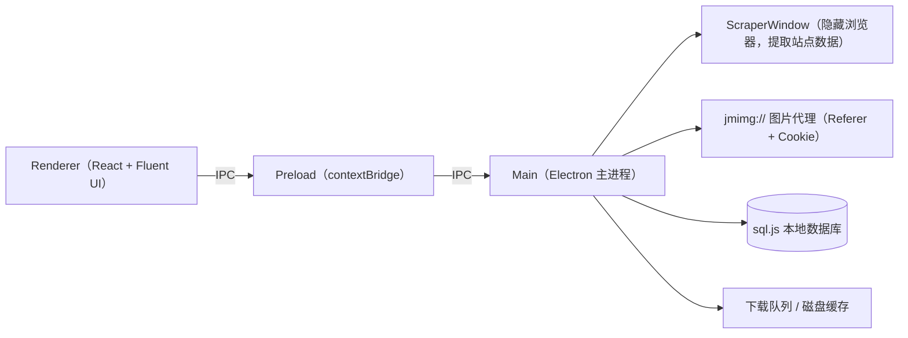

<p align="center">
  
</p>

<h1 align="center">JMComic Desktop</h1>

<p align="center">
  禁漫天堂（18comic.vip）Windows 桌面客户端 · WinUI 3 风格 · 便携单文件
</p>

---

一个 Windows 上用的禁漫天堂客户端。界面不是网页套壳，数据由后台隐藏窗口抓取，再交给前端原生渲染，整体走 WinUI 3 风格：无边框窗口、Mica 材质、Fluent 控件，看着比较像 Windows 11 原生应用。

便携版是单文件 exe，免安装，收藏、历史、下载记录等数据都存在 exe 同目录，删掉即清空，不往系统里留东西。

> 仅限成年人，请在合法合规的前提下使用。

## 功能

- 首页：推荐 / 最新 / 热门三个 Tab，卡片分批加载，不会一次全卡住
- 搜索：关键词、标签、历史记录，6~7 位车号直接跳详情页
- 分类：类型 / 子类型 / 排序 / 时间筛选，附 38 个热门标签
- 详情页：封面、章节列表、标签点击反查
- 阅读器：滚动 / 单页两种模式，虚拟滚动，键盘翻页，图片缩放，可还原站点的反打乱图片
- 下载：队列管理、失败一键重试、打开所在文件夹、下载完本地离线看
- 收藏：网站收藏和本地浏览历史两个视图
- 设置：代理、缓存、网络重探测、下载目录、数据导出 / 导入 / 清除
- 隐私：浏览记录、收藏、下载状态全部只存本机，不上传

## 架构上几个关键决定

站点内容是 JS 渲染的，纯 HTTP 拿不到，所以用隐藏 BrowserWindow 跑 `executeJavaScript` 提取数据，再经 IPC 传给渲染进程；多个抓取用互斥锁串行，避免互相打断。图片 CDN 有防盗链，自定义了 `jmimg://` 协议，由主进程代请求（补 Referer / Cookie / UA），渲染进程不直连 CDN。数据库用 sql.js（SQLite/WASM）跑在内存里，任何写入后必须 `saveDatabase()` 落盘，否则重启丢失。启动时会先引导完成 Cloudflare 验证，验证通过前不会触发抓取。



更详细的模块说明见 [docs/ARCHITECTURE.md](docs/ARCHITECTURE.md)。

## 快速开始

从 [Releases](../../releases/latest) 下载 `JMComic Desktop Portable <版本>.exe`，双击即用，无需安装。

## 从源码构建

需要 Node.js 18+ 与 npm：

```powershell
# 安装依赖
npm install

# 开发模式（Vite HMR + Electron），也可以双击 dev.bat
npm run dev

# 生产构建
npm run build

# 打包便携版单文件 exe
npm run package
```

## 项目结构

```text
src/
├── main/                 # Electron 主进程
│   ├── index.ts          # 入口：窗口、Mica 材质、协议注册、IPC 装配
│   ├── scraperWindow.ts  # 隐藏浏览器内容提取引擎（带互斥锁）
│   ├── contentApi.ts     # 首页 / 搜索 / 分类 / 详情 / 章节 IPC
│   ├── imageProtocol.ts  # jmimg:// 图片代理
│   ├── imageLoader.ts    # 图片磁盘缓存 + 并发下载管线
│   ├── downloadManager.ts# 下载队列与断点续传
│   ├── database.ts       # sql.js 初始化、迁移、表结构
│   ├── sessionWarmup.ts  # Cloudflare 会话预热
│   └── __tests__/        # 核心逻辑单元测试（tsx 直跑）
├── preload/              # contextBridge，统一暴露 electronAPI
└── renderer/             # React 18 + Fluent UI v9 + Tailwind
    └── src/
        ├── pages/        # 首页 / 搜索 / 分类 / 详情 / 阅读器 / 下载 / 收藏 / 设置
        ├── components/   # 漫画卡片、标题栏、登录弹窗、章节选择等
        ├── stores/       # zustand 全局状态
        └── theme/        # Aurora Clay 设计变量与样式
```

## 测试

没有引入测试框架，用手写的 `test()` 辅助函数 + Node `assert`，通过 tsx 直接跑：

```powershell
npx tsx src/main/__tests__/homepageLogic.test.ts
npx tsx src/main/__tests__/homepageStream.test.ts
```

CI 在每次 push / PR 时自动跑全部测试和生产构建（见 [ci.yml](.github/workflows/ci.yml)）。

## 贡献

欢迎提 Issue、PR 或改进建议，先读 [CONTRIBUTING.md](CONTRIBUTING.md)。

## Roadmap

- 封面图统一走 `jmimg://` 图片代理，解决封面加载失败
- 逆向站点数据接口，把页面加载从 3~15s 优化到 1s 内
- 阅读器磁盘缓存预取、章节预加载
- 下载导出 CBZ / ZIP 通用漫画格式
- 首页无限滚动
- 多标签页浏览、触控手势

## 免责声明

个人学习项目，与 18comic.vip 无任何关联；站点内容版权归原作者与平台所有。请勿用于商业或侵权用途，仅限成年人，遵守当地法律法规。

## 许可证

[MIT](LICENSE)
