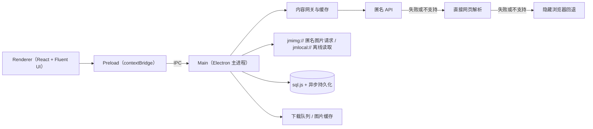

<p align="center">
  
</p>

<h1 align="center">JMComic Desktop</h1>

<p align="center">
  禁漫天堂（18comic.vip）Windows 桌面客户端 · WinUI 3 风格 · 便携单文件
</p>

---

一个 Windows 上用的禁漫天堂客户端。界面由 React 和 Fluent UI 构建，内容通过匿名 API 获取，必要时回退到直接网页解析或隐藏浏览器提取。整体采用 WinUI 3 风格：自定义标题栏、Mica 材质和 Fluent 控件。

便携版是单文件 exe，免安装。收藏、阅读进度、下载记录和设置保存在 exe 旁的 `JMComicData/jmcomic.db`；非便携运行使用 Electron 的 `userData` 目录。漫画默认下载到系统“下载”目录下的 `JMComic`，也可在设置中更改。迁移时需要保留数据目录和漫画文件，删除 exe 本身不会清空这些数据。

> 仅限成年人，请在合法合规的前提下使用。

## 功能

- 首页：推荐 / 最新 / 热门三个 Tab，卡片分批加载
- 搜索：关键词、标签、历史记录，6~7 位车号直接跳详情页
- 分类：类型 / 子类型 / 排序 / 时间筛选，附 38 个热门标签
- 详情页：封面、章节列表、标签点击反查
- 阅读工作区：左侧导航进入阅读后自动收成图标，中间保留浏览与详情，右侧按作品和来源打开阅读标签；支持独立续读、铺满窗口和系统全屏
- 阅读器：连续滚动 / 单页模式，图片适配与缩放、键盘翻页、章节目录和附近页缩略图，保存阅读偏好及页内进度，可还原站点的反打乱图片
- 下载：队列管理、失败重试、缺页修复、打开所在文件夹、离线阅读，以及单章或漫画中已完成章节的 CBZ 导出
- 收藏：本地收藏和浏览历史两个视图，无需登录账号
- 设置：代理、缓存、网络重探测、下载目录、数据导出 / 导入 / 清除
- 隐私：浏览记录、收藏、下载状态全部只存本机，不上传

## 架构上几个关键决定

内容获取统一经过 `contentGateway`：优先使用匿名 API，失败、数据校验不通过或筛选条件不受支持时，依次尝试直接网页解析和隐藏 `BrowserWindow` 提取。直接网页路径只覆盖部分搜索、推荐列表和章节请求；浏览器提取使用互斥锁串行导航。启动时后台探测 API，只有进入浏览器回退或手动重试验证时才调用网页会话预热。

在线封面和漫画图片通过 `jmimg://` 交给主进程，复用图片缓存、请求优先级和并发调度。请求补充 Referer / UA，并用 `credentials: 'omit'` 省略凭据；离线漫画通过限定下载目录的 `jmlocal://` 读取。在线阅读与下载共用反打乱算法。

阅读标签仅挂载当前章节，后台标签保留位置元数据；切换和关闭前等待进度与偏好保存，失败时保留当前阅读并提供重试。同一本书的在线和离线版本分开标记，重复打开同一章节不会增加标签。浏览导航不会关闭阅读区，关闭最后一个标签后恢复完整导航。

新下载按漫画和章节的稳定 ID 建立目录，旧记录继续使用原有标题目录。恢复下载、离线打开和 CBZ 导出共用页文件扫描，按原页号检查缺页；修复时重新取得章节清单并补齐缺失页，不重新编号现有页面。CBZ 导出只包含已完成且扫描齐全的章节。

sql.js 数据库保存在内存中，由异步写入协调器合并高频进度更新。收藏、设置等需要确认保存的操作等待落盘。正常关窗先等待阅读器保存进度和偏好，再停止下载与导出，最后刷新并关闭数据库；保存失败会保留窗口并显示原因。主库不可读时尝试经过完整性检查的备份，恢复时保留损坏原文件并提示用户，具体边界见架构文档。


```mermaid
flowchart LR
  R["Renderer（React + Fluent UI）"] --> P["Preload（contextBridge）"]
  P -->|IPC| M["Main（Electron 主进程）"]
  M --> G["内容网关与缓存"]
  G --> API["匿名 API"]
  API -->|失败或不支持| WEB["直接网页解析"]
  WEB -->|失败或不支持| SW["隐藏浏览器回退"]
  M --> IMG["jmimg:// 匿名图片请求 / jmlocal:// 离线读取"]
  M --> DB[("sql.js + 异步持久化")]
  M --> DL["下载队列 / 图片缓存"]
```

更详细的模块说明见 [docs/ARCHITECTURE.md](docs/ARCHITECTURE.md)。

## 快速开始

从 [Releases](https://github.com/wanna-code12138/JMcomic-desktop/releases/latest) 下载 `JMComic Desktop Portable <版本>.exe`，双击即用，无需安装。

## 从源码构建

建议使用 Node.js 22 与 npm，与 CI 环境保持一致：

```powershell
# 安装依赖
npm ci

# 开发模式（Vite HMR + Electron），也可以双击 dev.bat
npm run dev

# 生产构建
npm run build

# 打包便携版单文件 exe
npm run package
```

## 项目结构

```text
src/
├── main/                 # Electron 主进程
│   ├── index.ts          # 入口：窗口、Mica 材质、协议注册、IPC 装配
│   ├── scraperWindow.ts  # 隐藏浏览器内容提取引擎（带互斥锁）
│   ├── contentApi.ts     # 首页 / 搜索 / 分类 / 详情 / 章节 IPC
│   ├── contentGateway.ts # API → 直接网页 → 浏览器回退与结果校验
│   ├── content/          # 匿名 API 的发现、传输与数据解析
│   ├── imageProtocol.ts  # jmimg:// 图片代理
│   ├── imageNetwork.ts   # 图片请求调度、取消与重试
│   ├── imageLoader.ts    # 图片磁盘缓存与下载加载器
│   ├── downloadManager.ts# 下载队列、任务恢复与缺页补齐
│   ├── downloadCore.ts   # 稳定目录、旧路径兼容与页文件扫描
│   ├── downloadExport.ts # CBZ 导出入口（归档写入在 cbzExport.ts）
│   ├── database.ts       # sql.js 初始化、迁移、异步持久化与恢复
│   ├── shutdownController.ts # 渲染器保存、停止下载/导出、数据库关闭的顺序
│   ├── sessionWarmup.ts  # 浏览器回退所需的按需会话验证
│   └── __tests__/        # 主进程与共享逻辑回归测试
├── preload/              # contextBridge，统一暴露 electronAPI
├── shared/               # 阅读器契约、反打乱算法等跨进程逻辑
└── renderer/             # React 18 + Fluent UI v9 + Tailwind
    └── src/
        ├── pages/        # 首页 / 搜索 / 分类 / 详情 / 阅读器 / 下载 / 收藏 / 设置
        ├── reader/       # 阅读会话、图片、工具栏、布局计算与样式
        ├── components/   # 漫画卡片、标题栏、章节选择等
        ├── stores/       # zustand 全局状态
        └── theme/        # WinUI 主题与语义样式
```

## 测试

统一测试入口递归发现 `src/` 和 `scripts/` 下的 `*.test.ts`、`*.test.mjs`。TypeScript 测试通过 `tsx` 执行，`.mjs` 测试使用 Node 测试运行器：

```powershell
npm test              # 全部自动化测试
npm run typecheck     # TypeScript 类型检查
npm run check         # 依次运行测试、类型检查和生产构建
```

CI 在向 `main` 推送和 Pull Request 时运行测试、类型检查与生产构建（见 [ci.yml](.github/workflows/ci.yml)）。阅读器交互、真实 Canvas 和网络回退仍需按改动范围补充 Electron 验收，记录实际环境与结果；历史性能报告不代表当前版本的测量值。

## 贡献

欢迎提 Issue、PR 或改进建议，先读 [CONTRIBUTING.md](CONTRIBUTING.md)。

## Roadmap

- 持续测量不同内容路径的首屏、回退率和缓存命中，扩大经验证的 API / 直接网页覆盖范围
- 评估下一章预加载的收益、取消行为和缓存成本
- 完善长章节、混合尺寸图片、触控与无障碍阅读体验
- 首页无限滚动
- 评估跨进程恢复全部阅读标签的必要性，当前重启通过历史记录恢复阅读

## 免责声明

个人学习项目，与 18comic.vip 无任何关联；站点内容版权归原作者与平台所有。请勿用于商业或侵权用途，仅限成年人，遵守当地法律法规。

## 许可证

[MIT](LICENSE)
