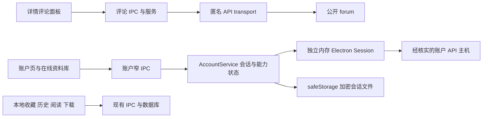

# JMComic Desktop 1.3.0 评论与在线账户调研设计

日期：2026-10-02。基线：`190aff86a94466af43fa02703dbfc7007d218550`，源码版本 `1.2.0`。设计分支：`feat/1.3.0-account-design`。

状态：**用户已批准设计与后续增强分轮实施；核心已实现为 1.3.1，正在逐轮验收**。下文保留批准时的调查结论和范围，当前实施证据见[核心验证记录](../../outputs/verification/1.3.1/progress.md)，进展见[执行清单](../plans/2026-10-02-1.3.0-preparation-and-execution.md)。

## 1. 推荐方案与批准范围

1.3 首先交付能独立使用的评论阅读，再建立可靠的单账户会话，最后接入在线资料库与常用账户互动。沿用 Electron、TypeScript、React、Fluent UI 和当前三栏阅读工作区；不把 Python 或 Java 客户端作为运行依赖。

建议批准的 **1.3 核心范围**：

- 匿名查看作品评论：分页、回复展开、剧透遮挡、刷新与局部重试。
- 登录、加密记住会话、启动恢复、重新验证、退出；账户概览。
- 在线收藏：分页、读取现有收藏夹、按夹查看、添加与取消收藏。
- 在线历史：只读浏览、打开作品；保留本地精确续读。
- 追更：列表、状态、开启与取消。
- 通知：列表、未读数、用户明确操作后标记已读。

这些能力均有源码或历史依据，但账户端点仍需本轮真实会话验证。完成标准包含真实验证，不能用一个隐藏或永远禁用的按钮宣称功能完成。核心端点若无法证明可用，应记录为发布阻塞，并给出具体证据请用户决定缩减范围；不得自行把缺失功能算作完成。

**后续增强候选**：发表/回复评论、我的评论、作品点赞、手动签到及日历、任务只读、收藏夹增删改移、收藏标签、历史删除、资料编辑。它们不是本文件推荐核心范围的隐含交付，详见功能矩阵。

**本轮不接入**：评论投票、自动签到、自动批量同步、密码保存与后台自动重登、充值/购买/奖励领取/免广告、已购受限内容、小说/博客/创作者子系统、多账户同时在线。注册、找回密码优先保留经核实的官方页面入口，不能根据 API 名字直接开放。

## 2. 证据如何解读

| 标记 | 含义 | 能证明什么 |
| --- | --- | --- |
| 当前实测 | 本轮实际执行的公开 GET 或本地实验 | 只证明已执行的场景 |
| 历史实测 | 仓库 2026-09-03 的验证记录 | 当时曾可用，不能替代当前验证 |
| 源码依据 | 本轮读取的上游固定提交 | 确认实现、参数与维护状态，不能证明服务器仍接受 |
| 未证实 | 缺少当前可靠协议或行为证据 | 不承诺支持，不猜测字段与语义 |

外部来源均为项目维护者自己的源码/发布记录及 Electron 官方文档，并非官方 JM API 稳定性承诺：

- **J1**：[Java 客户端，提交 5a7a4bb（2026-10-01）](https://github.com/JUKOMU/JMComic-Api-Java/blob/5a7a4bb4870edb512274dc2adeb4f7c157445321/jmcomic-core/src/main/java/io/github/jukomu/jmcomic/core/client/impl/JmApiClient.java)。覆盖登录、收藏、评论、追更、通知、签到等实际请求。
- **J2**：[Java 接口维护状态](https://github.com/JUKOMU/JMComic-Api-Java/blob/5a7a4bb4870edb512274dc2adeb4f7c157445321/jmcomic-api/src/main/java/io/github/jukomu/jmcomic/api/client/JmClient.java)。评论投票明确注明平台停用；注册、找回密码和多项经济操作标记 Deprecated，但后者不能据此一概断言服务端已停用。
- **J3**：[端点常量](https://github.com/JUKOMU/JMComic-Api-Java/blob/5a7a4bb4870edb512274dc2adeb4f7c157445321/jmcomic-core/src/main/java/io/github/jukomu/jmcomic/core/constant/JmConstants.java)、[评论查询参数](https://github.com/JUKOMU/JMComic-Api-Java/blob/5a7a4bb4870edb512274dc2adeb4f7c157445321/jmcomic-api/src/main/java/io/github/jukomu/jmcomic/api/model/ForumQuery.java)、[收藏夹操作类型](https://github.com/JUKOMU/JMComic-Api-Java/blob/5a7a4bb4870edb512274dc2adeb4f7c157445321/jmcomic-api/src/main/java/io/github/jukomu/jmcomic/api/enums/FavoriteFolderType.java)。
- **J4**：[Java 响应解析](https://github.com/JUKOMU/JMComic-Api-Java/blob/5a7a4bb4870edb512274dc2adeb4f7c157445321/jmcomic-core/src/main/java/io/github/jukomu/jmcomic/core/parser/ApiParser.java)。
- **P1**：[Python 客户端，提交 5a3f627（2026-09-28）](https://github.com/hect0x7/JMComic-Crawler-Python/blob/5a3f627cea76030886f3da452ffb8ec7a540a0bb/src/jmcomic/jm_client_impl.py)。登录、评论读取、收藏 Toggle、签到。
- **P2**：[Python 评论实体与分页](https://github.com/hect0x7/JMComic-Crawler-Python/blob/5a3f627cea76030886f3da452ffb8ec7a540a0bb/src/jmcomic/jm_entity.py)、[文本与页面解析](https://github.com/hect0x7/JMComic-Crawler-Python/blob/5a3f627cea76030886f3da452ffb8ec7a540a0bb/src/jmcomic/jm_toolkit.py)。
- **C1**：[jmcomic-next 发布记录](https://github.com/HongShi2333/jmcomic-next/releases)。维护者记录过不同 client 不共享会话引发 401、收藏总页数误当总条数导致只能显示首页的修复。作为同类失败模式参考，不据此推断本项目已发生同样根因。
- **E1**：[Electron Session](https://www.electronjs.org/docs/latest/api/session)、[safeStorage](https://www.electronjs.org/docs/latest/api/safe-storage)、[安全指导](https://www.electronjs.org/docs/latest/tutorial/security)。

两套参考库均为 MIT；若实施时移植有实质表达的源码，保留许可和归属。优先复用本项目已验证的签名、解密和网络限制，仅借助上游确认协议。

## 3. 上次为什么没有成功

### 3.1 两次尝试与当前基线

| 对象 | 本轮查到的事实 | 对 1.3 的意义 |
| --- | --- | --- |
| 2026-07 的网页账户方案，`cf203ab^` | 以用户名非空判断 loggedIn；会话 Cookie 直接写入 `auth` 表，密码才使用 safeStorage；验证异常统一视为登录无效；随后回退 | 不复用其身份与存储模型，不把普通网络故障当注销 |
| 2026-08/09 的移动 API 方案，最终 `6fdc90a` | 已有独立内存 Session、加密 vault、generation/lease、众多 UI 和协议模块；部分能力仍为桩或 unavailable | 逐功能审计可复用内容，不整体合并回退分支 |
| 历史记录 `ae25152` 及 `6fdc90a:docs/plans/2026-09-03-online-account-progress.md` | 记载登录后数秒再次进入 verification-required，尚未定位触发端点；也记载同一 AVS 下部分接口 200、部分 401 | 真实掉登录的最终原因仍未确诊；不能直接归因于某个猜测 |
| 当前 `190aff8` | `src/main/account/` 与登录 UI 已移除；现有收藏和历史均为本地；`auth` 只用于旧数据清理兼容 | 新能力在当前 1.2 架构上建设；旧入口已不构成可用基础 |

### 3.2 本轮对旧生产代码的可复现实验

实验通过 `git show 6fdc90a:<path>` 读取并执行旧模块，使用合成数据和注入的 I/O；没有恢复旧分支、访问真实账户或修改旧实现。完整结果见 [history-observations.json](../../outputs/research/1.3.0/history-observations.json)。

| 实验 | 实际结果 | 结论 |
| --- | --- | --- |
| 一个主评论带 `replys` 中的一条回复 | 旧 parser 输出 0 条回复 | 字段不匹配，回复丢失 |
| `spoiler="2"` | 输出 `false` | 剧透被当作普通内容 |
| `spoiler="1"` | 输出 `true` | 普通评论反而被标为剧透 |
| 评论 envelope 缺少 list 等已知结构 | 输出空列表、total=null | 协议异常会伪装成“没有评论” |
| 调用 `ensureSessionValidated` | 不增加任何远端调用，返回 validated | 实际只检查本地租约，不能用作远端有效性证明 |
| 当前 scope 报认证失败 | 整个账户进入 verification-required | 缺少端点级降级和重新核实 |
| 重新认证进行中排入旧 scope 的 401，重复 100 次 | 新会话保留 authenticated，generation=2，100/100 | 最后版本的队列内复检保护了该时序；不能把早期竞态猜测当作仍未修复的根因 |

额外静态事实：旧 transport 把 HTTP 401 与 403 都映射成 AUTH_REQUIRED；登录/恢复只用 `/useredit/{uid}` 校验；资料 parser 在缺少身份字段时沿用原身份。结合历史“部分端点 200/401”的记录，这些设计不足以保证完整会话可用。它们解释了为什么测试通过仍可能掉登录，但尚不足以证明当时每次失败的唯一成因。

### 3.3 不能沿用的交付判断

历史 70/70 自动测试与 build 通过，不等于真实 GUI 所有面板完成；旧记录明确保留评论写入、文件夹/标签、购买、已购阅读等未完成项。1.3 必须区分协议单元测试、真实 IPC、真实 Electron Session 和远端实际行为，按阶段记录证据。

## 4. 当前公开评论验证

2026-10-02 22:15（Asia/Shanghai），使用当前生产代码的签名、解密和有界 fetch port，通过 Node fetch 发出匿名 GET；`credentials: omit`，不读取应用用户目录。

- `/setting` 在当前受信候选主机成功，返回运行时版本 `2.1.9`。这是当次观测，不把该值写死成长期配置。
- 样本 `123456`：`mode=all` 第 1、2 页各 10 条，第 4 页 4 条，`total="34"`；第 4 页包含 3 条内嵌回复，字段确为 `replys`。
- 上述样本同时出现 `spoiler="1"` 与 `"2"`。含义由 P2/J4 交叉确认；两种值必须有独立测试。
- 第 1 页 `mode=all` 与 `mode=manhua` 的评论 ID 摘要一致；不能外推为所有作品和模式永远等价，也不能把这两个参数误当“最新/热门”排序。
- 第二样本 `1173049` 返回 4 条主评论，total=4。
- 只保存字段名、数量、模式和 ID 集合摘要；不保存评论正文、用户名、用户 ID、Cookie 或原始响应。

证据：[public-comments-probe.json](../../outputs/research/1.3.0/public-comments-probe.json)。这证明公开评论的协议路径可用；**没有验证未来 UI、Electron 账户分区、真实登录或远端写入**。

## 5. 在线账户功能全景与接入建议

以下是所调查接口与现有产品有关的完整能力清单，不声称覆盖 JM 服务所有未公开功能。所有账户写入目前均未实际执行。

| 能力 | 接口/语义依据 | 证据与限制 | 建议与入口 |
| --- | --- | --- | --- |
| 登录/退出 | POST `/login`、`/logout`；登录身份与 `s` 会话值 | J1/P1，历史实测；本轮未登录 | 核心；账户入口，退出立即清本机有效会话 |
| 记住/恢复登录 | 本地 Session + safeStorage，不是“刷新 token 接口” | E1、旧实现；服务端有效期未证实 | 核心；只记加密会话，不保存密码 |
| 账户概览 | 登录响应的昵称、等级、经验、余额、收藏数量/额度 | J1/P1，历史实测；资料接口并不保证返回这些字段 | 核心；显示时间与未知值，不补成 0，不静默重登刷新余额 |
| 个人资料读取 | GET `/useredit/{uid}` | J1，历史实测；并非充分的认证证明 | 核心概览辅助，缺失字段不阻止已验证账户使用 |
| 资料修改 | POST `/useredit/{uid}` | J1；可写字段和服务端校验未逐项实测 | 后续；仅明确字段，不扩成改密码/头像上传 |
| 注册/找回密码 | `/register`、`/forgot` | J2 标记 Deprecated；验证码与新流程未核实 | 官方页面接续，链接需单独核实；不在应用内代办 |
| 在线收藏分页 | GET `/favorite?page&folder_id&o` | J1/P1、历史实测；必须区分 total 条数与总页数 | 核心；收藏页的“在线”来源，读取现有夹 |
| 收藏/取消收藏 | POST `/favorite`，body=`aid`，**Toggle** | J1/P1；重复发送会反向切换；本轮未写 | 核心；详情页独立“在线收藏”，发送后核对状态 |
| 收藏夹创建/改名/移动/删除 | POST `/favorite_folder`，`type=add/edit/move/del` | J1/J3；删除对夹内作品的实际影响未证实 | 后续；先验证删除语义和失败后的部分结果 |
| 收藏标签读取/增删 | GET `/tags_favorite`；POST `/tags_favorite_update`，`type/tags` | J1/J4；这是账户标签集合，没有每本作品的标签绑定参数 | 后续；不可包装成任意作品的私人标签编辑 |
| 在线浏览历史 | GET `/watch_list?page` | J1/J4、历史实测；现有依据是作品列表，没有精确页码/页内偏移 | 核心；历史页的“在线”来源，打开作品；本地才负责精确续读 |
| 删除在线历史 | POST `/watch_list`，body=`id` | J1；范围和幂等语义须实测 | 后续；单项明确确认，清空本地绝不触发它 |
| 连载追更 | POST `/album_tracking` 读取；GET/POST `/album_sertracking` 读取/切换 | J1、历史读验证；POST 也可能是只读查询 | 核心；收藏页追更视图、详情状态；写请求不自动重放 |
| 作品点赞 | POST `/like`，body=`id` | J1；独立于评论投票，内层 status 也须校验 | 后续；不与现有本地爱心混用 |
| 作品评论/回复读取 | GET `/forum?aid&mode&page`，`replys` | J1/P1/P2，**本轮匿名实测** | 核心；详情评论面板，无需登录 |
| 我的评论/用户评论 | GET `/forum?uid&mode&page` | J3；本轮未测身份/可见性与分页 | 后续；账户页，不猜测私密评论可见性 |
| 发表/回复评论 | POST `/comment`，`aid/comment/comment_id`，顶层为 0 | J1 有实现；P1 的 API 客户端仍抛 NotImplementedError，不能据此断言服务端不支持 | 后续；显式发送、草稿、结果未知；不自动发表测试内容 |
| 评论点赞/点踩 | `/comment_vote` | **J2 明确注明平台已停用**；本轮未对服务器写入验证 | 不承诺；可显示已有点赞数，不显示可点击投票 |
| 评论编辑/删除/举报 | 未获得可靠的窄接口与确认语义 | 未证实 | 不承诺，不用网页猜测接口 |
| 通知与未读数 | GET `/notifications`、`/notifications/unreadCount` | J1，历史实测；列表裸数组/对象形状曾漂移 | 核心；账户页消息面板，按需读取 |
| 通知已读状态 | POST `/notifications`，`id/read` | J1；本轮未写 | 核心；用户点击“标为已读”；打开列表不隐式发写请求 |
| 签到状态/日历 | GET `/daily`、`/daily_list`；POST `/daily_list/filter` 只读 | J1/P1，历史读验证；服务器日期语义待核实 | 后续；账户活动页 |
| 手动签到 | POST `/daily_chk`，`user_id/daily_id` | J1/P1；涉及奖励，重复响应不能等同首次成功 | 后续；按钮触发、结果核对，默认不自动签到 |
| 任务读取/领取 | GET/POST `/tasks` | 读取有 J1/历史依据；领取在 J2 Deprecated，参数不清晰 | 后续可只读；不接领取 |
| JCoin/购买记录/充值/免广告 | `/coin`、`/coin_buy_comics`、`/coin_buy_charge`、`/ad_free` | J1/J2，多个已 Deprecated；存在经济影响 | 本轮不接；余额仅作带时间的只读信息 |
| 已购/受限内容权益 | `/album` 权益字段与账户内容请求 | 历史 price/purchased 为空；没有已购与未购负向对照 | 本轮不接；不改变现有匿名阅读链路 |
| 跨设备精确续读/自动双向同步 | 未找到本项目需求所需的页码写入和冲突解决协议 | 未证实 | 本轮不承诺；在线历史不等于续读同步 |

## 6. 如何融入现有桌面体验

### 6.1 详情中的评论

在 `MangaDetailPage` 的章节区域使用“章节 / 评论”标签，默认仍选章节；标题处的评论入口可直接打开评论标签。评论首屏只在用户打开后请求，不加入现有详情加载的 `Promise.all`，不延迟“开始阅读”、图片或下载。

每条显示昵称、时间、正文和可选头像，回复嵌套展开；剧透默认遮挡，明确点击后展开。默认使用上游现有顺序，不制作无依据的“最热”排序。缺少总数显示“评论”，而不是“评论 0”；没有内容、加载失败、接口格式改变、离线分别有独立状态。

评论页码以主评论计算，不能把回复数加进分页总数。使用稳定 CID 去重，跨页刷新时检测重复页，保留已加载内容。无法获得父评论的扁平回复保留“回复”标记，不凭空补父内容；嵌套结构优先使用经证实的 `replys`。超过显示限制明确标记截断，不静默假装完整。

详情和阅读区并存：右侧继续阅读，中间查看当前详情的评论。切换右侧标签时不自动把中间评论切成另一作品；明确标注当前作品，避免阅读 A 时误以为正在看 A 的评论。未来若增加阅读器评论按钮，它只能显式导航当前阅读作品的详情，不能增设第四栏或改变焦点/续读保存逻辑。

本地详情仅在存在可验证的原作品 ID 且用户主动打开评论时联网；离线仍能打开本地章节。评论面板不成为离线阅读的前置条件。

### 6.2 账户入口与收藏页

- 主导航底部新增“账户”，图标折叠态保留 Tooltip/可访问名称；主体放入中间 PageHost，右侧阅读工作区保持原状。
- 未登录的账户页提供登录表单和默认不勾选的“记住会话”；成功后显示概览、会话状态、追更/通知入口与退出。设置页增加紧凑的“账户与隐私”行，跳转同一账户页，避免两套登录表单。
- 收藏页一级分“收藏 / 历史 / 追更”；收藏、历史内部提供“本地 / 在线”来源切换。每个来源保留独立页码、滚动和加载状态，窄详情容器也可横向滚动标签而不挤成多行大工具栏。
- 在线收藏读取已有 `folder_list` 并按夹浏览；列表默认保持服务端顺序，可用排序参数只显示已验证项。翻页不把 `totalItems` 误作 `totalPages`。
- 现有卡片爱心继续表示本地收藏；详情明确写“本地收藏”和“在线收藏”。不让同一按钮随登录状态改变含义，也不把本地书架批量上传。
- 登录后仅刷新可见账户面板；后台保活页面在 `currentPage` 不匹配时取消请求和轮询。不能仅依赖组件卸载，因为 PageHost 会缓存页面。
- 通知在账户页集中展示；第一版不启用系统通知或后台定时抓取。未读数显示可用结果，失败不把数字强置 0，不自动标记已读。

账户概览未知字段显示“暂不可用”，使用既有 `--ui-*` 主题、Fluent 控件和动效开关。错误文案针对操作，如“在线收藏暂时无法连接，点击重试”；协议名、host、generation 不进入普通用户流程。

### 6.3 本地与在线数据关系

两者是不同来源。退出仅清账户会话和账户内存缓存，不删除本地收藏、下载、PDF、阅读标签或本地历史。本地“清空历史”不调用在线删除；个人数据导入只影响本地，不触发远端同步。

在线作品通过现有 `setCurrentMangaId` 进入详情。只有本机保存了章节、页码与页内偏移时才提供“继续阅读”；在线历史本身只提供“查看作品”。同一本书在线/离线阅读标签的既有身份规则保持一致。

## 7. 实现架构与边界

### 7.1 复用与新增

| 位置 | 改动职责 |
| --- | --- |
| `src/main/content/jmAppApiCrypto.ts`、`jmAppApiProfiles.ts` | 复用纯签名/解密/profile；不复制第二套盐常量 |
| `src/main/content/jmAppApiRuntime.ts`、`jmAppApiTransport.ts` | 让评论复用匿名路由发现和 GET transport；小范围抽出 route 获取，不让 ContentGateway 承担账户职责 |
| 新 `src/shared/commentContracts.ts`、`src/main/comments/` | 评论窄契约、parser、按需读取与有界内存缓存 |
| 新 `src/shared/accountContracts.ts`、`src/main/account/` | 最小身份、Session、vault、认证传输、在线库/追更/通知；不恢复购买、权益和账户图片框架 |
| `src/preload/index.ts`、新账户/评论 IPC 模块 | 明确方法签名和 sender 验证，传 DTO，不传任意 URL 或 raw fetch |
| `src/main/networkProbe.ts`、`index.ts` | 独立账户 Session 同步现有代理设置；生命周期和安全初始化接线 |
| `src/main/ipc.ts`、`personalData.ts`、`shutdownController.ts` | 清账户数据与关闭流程联动；导出排除会话；不改变本地数据语义 |
| `MangaDetailPage.tsx`、新 `components/comments/` | 评论标签、局部加载、回复、剧透与错误状态 |
| 新 `pages/AccountPage.tsx`、`stores/accountStore.ts` | 主进程状态的镜像；表单密码不进入 store |
| `FavoritesPage.tsx`、`AppNavigation.tsx`、`PageHost.tsx`、`appStore.ts`、`SettingsPage.tsx` | 账户入口、来源切换、路由与可见性控制，保留阅读工作区 |

`JmAppApiTransport` 当前只允许 GET 且 fetch port 显式 `credentials: omit`，不能原样用于登录。账户 transport 独立承担 POST、会话 Cookie、写请求语义和错误分类；两条链只共享纯协议函数。匿名路由的允许域规则较宽，不能直接升格为发送凭据的信任列表。

### 7.2 评论与账户最小数据契约

- `CommentPage`：`albumId, page, items, total: number|null, hasMore: boolean|null, fetchedAt, truncated`。单条含 CID、可空用户标识、显示名、纯文本、原始时间/可解析时间、可空头像、剧透状态、parentId、replies。UID 缺失不能抹掉合法评论；缺 CID 或 envelope 漂移必须报告解析问题。
- `AccountStatus`：`phase, generation, sessionId, overview, persistence, capabilities, lastValidatedAt, warningCode`。sessionId 是随机本地标记，不是 AVS。
- `AccountResult<T>`：成功 DTO，或限定的错误码与操作建议。错误至少区分 `AUTH_REQUIRED / SESSION_EXPIRED / STALE_SESSION / NETWORK_ERROR / RATE_LIMITED / VERIFICATION_REQUIRED / UPSTREAM_CHANGED / CAPABILITY_UNAVAILABLE / OUTCOME_UNKNOWN`。
- 列表统一明确 `page / totalItems / hasMore`；对总数未知的历史不能根据一次解析空数组擅自认定最后一页。
- 账户 IPC 入参只含业务 ID、页码、合法筛选和 expectedGeneration；uid、host、profile、Cookie 由主进程绑定。密码只存在登录表单的短暂状态和一次 login invoke 参数，不回传、不缓存、不写日志。

### 7.3 会话生命周期与认证证明

状态包括 `anonymous → authenticating/restoring → authenticated`，异常时分别进入 `verification-required` 或 `expired`。网络故障以错误/能力状态表达，不自动擦除已保存会话。

1. 用户登录时创建随机、不带 `persist:` 前缀的内存 Session，关闭该分区磁盘缓存，先应用当前代理，再向固定且经核实的 credential origin 发送一次登录。
2. 把登录响应的身份、AVS 及经验证必需的 Cookie 绑定到这一个 Session。读取真实 `Set-Cookie` 的作用域与过期规则，不把任意 Cookie 扩散到其他候选主机。首次登录产生的 Cookie 集合与重启恢复后的集合必须做一致性验证，不能先假定只保存 AVS 已足够。
3. 选定最小“认证证明端点”：候选为账户收藏读取，必要时加历史读取。实施前以同一端点的匿名响应、无效会话响应和有效会话响应作对照，确认不会把公开数据/游客空列表当作登录成功。`/useredit/{uid}` 只作辅助，任务/签到不成为登录门槛。
4. 通过身份与认证证明后再保存加密会话、一次提交新 generation 并发布状态。候选失败不得覆盖已工作的会话。记住模式的磁盘保存失败给出明确错误；用户可以选择仅本次登录，不静默降级为“已记住”。
5. 恢复先解密到新的内存 Session，再做同样认证证明。未证实前不显示已登录；系统密钥不可用或跨机器无法解密时要求重登，保留本地阅读数据。
6. 每个受保护请求在入队、真正发送前、提交结果前核对 `generation + sessionId + origin + profile`。重新登录、退出和更换会话时废弃旧请求；旧成功和旧 401 均不能改变新账户。
7. 可选端点认证异常先标记该端点不可用并冻结写入，触发一次合并的认证证明检查。证明仍有效则恢复账户状态，仅降级该端点；明确会话失效才进入 expired 并清敏感状态。403 挑战页、签名/版本错误、429、网络超时与 session 失效分别处理。
8. 退出立即推进 generation、停收账户操作、取消请求、清 UI/账户缓存。只有 logout 可以在已经捕获的旧 Session 上发送一次、最多等待 3 秒；完成或超时后在 finally 清该 Session，vault 清理并行执行。普通请求不能再使用这份租约。远端失败不阻止本机退出，但须显示远端撤销未确认；磁盘删除失败明确报告，不能声称“已彻底清除”。

所有状态提交由一个生命周期协调器拥有。耗时网络 I/O 不允许把退出或取消无限阻塞在长队列里；候选请求带 attemptId 和 AbortSignal。作废与发布状态在同步提交中完成，资源清理可随后等待，避免 lease 已撤销但 UI 长期显示 authenticated。

### 7.4 凭据、代理、清理与诊断

E1 说明非 `persist:` 分区是内存会话；记住功能使用独立 safeStorage 文件持久化经核实的会话字段。Windows 加密不能承诺可跨机器迁移，也不能保护同一系统用户下的所有恶意进程。第一版不保存密码，不用永久 Chromium 分区和 vault 同时保存两套会话。

会话文件位于现有 `dataPaths` 决定的数据目录，版本化、原子写入；纳入个人数据清除，排除个人数据导出。便携包在另一 Windows 用户或机器运行时显示“需要重新登录”，不覆盖本地收藏/下载。旧 `auth` 数据不自动转换为新会话，也不扫描其他应用的凭据。

账户 Session 必须注册到代理更新流程。当前 `applyManualProxy` 只改 defaultSession；若直接照搬，就可能出现图片正常、账户却无法连接。代理设置提交前暂停账户新请求，更新 Session、关闭旧连接，再恢复；失败保持明确状态，不把代理错误归为密码错误。

同一数据目录以 Electron 单实例锁保护 vault 写入，第二次启动激活已有窗口；便携数据路径须在锁与账户初始化前确定。关窗先冻结新账户操作、取消查询/候选登录并等待已开始的 vault 原子写入，再进入既有保存退出流程；不因关窗自动发远端 logout。

新 IPC 检查受信任主窗口与 frame，隐藏抓取/验证网页不能调用账户方法；外部导航只接受核实后的固定业务目的地。评论/通知正文转纯文本，不执行远端 HTML，不自动打开正文链接；头像通过受控匿名图片路径读取，失败用占位图，不能给图片 CDN 附带账户 Cookie。

诊断仅记录 operationId、端点枚举、耗时、HTTP 状态、错误类别、会话代次及请求阶段；不记录请求体、Cookie、响应正文、用户名、邮箱、个人历史或可还原身份的 URL。应能定位“哪个端点在新旧哪一代返回了 401”，无需临时打开敏感日志。

### 7.5 缓存与远端写入

公开评论使用短 TTL 内存缓存（设计初值 60 秒 fresh、5 分钟 stale、100 页且总计不超过 4 MiB），key 包含作品、页码和模式，后台刷新必须有可见消费者。个人列表第一版只放有界内存，不写入公共 content-cache.json；key 包含账户 sessionId/generation，退出清空。限值在行为测试里验证，不视为性能测量结论。

收藏、追更等按作品串行修改。UI 提交期望状态；主进程先读取可信现状，需要变化时才发送一次 Toggle，然后重新读取确认。外部官方客户端仍可能并发改动，因此这不是服务端原子 CAS，不能承诺跨客户端 exactly-once。

超时或断网发生在发送后时标记 `OUTCOME_UNKNOWN`，只读核对后才能再次操作；不能把普通 GET 重试规则套到 Toggle。按钮防双击与 IPC operationId 去重只解决本客户端重入，不伪装成服务端幂等。默认不保存跨重启的待发远端写队列，重启后读取现状，不重放。

通知标已读虽有目标状态，也采用单次提交和读取核对。读取追更、签到日历的 POST 在注册表中明确标为 read-post；HTTP 方法不能代替业务语义判断。后续评论发布一旦结果未知，必须保留用户草稿并提示核查，不自动重发，也不把乐观插入当成功。

## 8. 方案取舍

| 方案 | 判断 |
| --- | --- |
| 整体恢复 `rollback-online-account-6fdc90a` | 不采用。包含未完成经济/权益框架、已证实的评论解析问题和旧 UI，且会与 1.2 新架构冲突 |
| 完全使用嵌入网站承载账户/评论 | 不作为主方案。与桌面三栏和可控错误状态衔接较差，也无法解决结构化收藏和会话一致性；遇到验证码可提供明确人工接续，但不能用绕过验证代替认证 |
| 引入 Python/Java 辅助服务 | 不采用。已有 TypeScript 协议和 Electron Session 足够；额外运行时、打包与凭据传递成本超过收益 |
| 复用现有匿名协议核心，独立账户服务，按能力验收 | 推荐。公开评论可先交付，账户错误局限在账户区域，并能直接复用当前阅读/下载功能 |

## 9. 验收与发布阻塞

| 验收面 | 必须覆盖 |
| --- | --- |
| 评论 | 匿名分页/末页/空页、嵌套回复、`spoiler=1/2`、恶意 HTML、畸形 envelope 不冒充空页、超长文本、重复 CID、取消和切作品迟到响应 |
| 身份 | 正确/错误密码、有效/无效会话对照、记住/不记住、重启/跨机器不可解密、登录中退出、两次登录竞争、账户 A 的结果不流入 B |
| 401 分类 | 旧 401 与新登录、可选端点 401 而认证证明正常、真正失效、403 验证页、429、网络断开、系统时钟或版本异常 |
| Session 与代理 | defaultSession 无账户 Cookie、账户恢复 Cookie 集合正确、分区代理修改生效、重定向不泄漏凭据、双启动互斥、清理失败如实反馈 |
| 资料库 | 超过一页收藏/历史、多个文件夹、总数未知、来源切换保留状态、本地续读不被在线历史覆盖 |
| 写入 | 收藏/追更开启与取消、重复点击、发送前取消、服务器执行后连接断开、读取核对失败；仅使用获准测试对象 |
| UI 与桌面回归 | 三栏与铺满、最小窗口 960×640、100/125/150/200% 缩放、明暗主题、键盘/读屏、动效开关、页面保活不后台请求、离线本地阅读、图片/PDF/CBZ |
| 性能 | 未打开评论/账户时不发新增列表请求；评论首屏不阻塞详情/阅读；与当前基线同条件测启动、首图和内存，不用 build 时间作启动性能 |

自动测试全部使用合成 fixture 和本地受控服务，严格先运行有意义的失败测试再实现。真实账户验证由用户在应用中输入账户，先只读验证；收藏、追更、通知写入使用明确获准的测试对象。一次授权在同对象和范围内持续有效，不每个按钮重复申请。

核心发布阻塞：认证证明端点未通过对照；真实登录仍快速掉线且原因未明；核心功能在当前服务无法工作；真实 Electron 分区/代理/vault 路径未验证；结果未知的写入会被自动重复发送。纯 UI 或 parser 测试通过不能消除这些阻塞。

## 10. 本次设计自审

- 用户明确要求的“查看评论”独立于账户，已有当前匿名证据；没有把“查看”自动扩大为公开发言。
- 区分了当前实测、历史记录、源码依据与未证实能力；真实登录根因仍保留不确定性。
- 旧方案的竞态假设已实验复核，未将已存在的双检重复宣称为新发现的修复。
- 账户数据、代理、保活页面、三栏阅读、退出/清理/便携恢复都有具体接入位置。
- 核心与增强边界明确，未提供一个带大量不可用按钮的“全功能”承诺。
- 本轮不修改生产源码、依赖或版本配置，不访问历史凭据；正式实现须先批准本设计。
