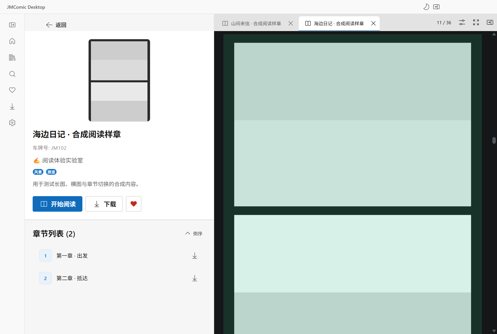
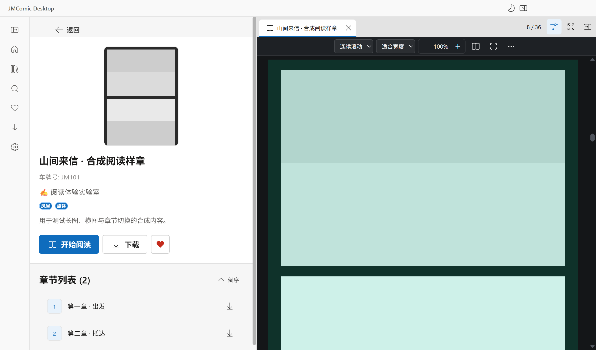
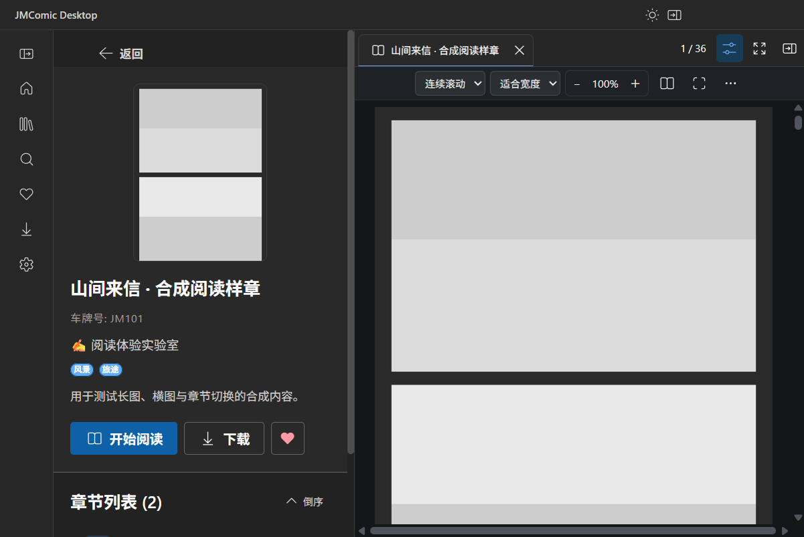

# 1.0.7：阅读工具、侧栏标签与 EPIPE 修复

日期：2026-09-29。分支：`feat/project-improvement-review`。范围：用户批准的 A 方案、多漫画标签与侧栏独立显隐，以及工作中报告的连续 EPIPE 弹窗。

## 交付行为

- 工具首次打开时折叠；标签栏右侧按钮或阅读区域内的 H 手动切换。鼠标移动和滚轮不自动弹出上下浮层。
- 展开工具占用顶部约 40 px，漫画视口随之调整，不覆盖画面。底部浮动页码与控制栏已移除。
- 页码位于常驻标签栏，点击打开跳页、前后页和前后章菜单。成功跳页后焦点返回阅读区域。
- 每本漫画有独立标签和 X。关闭后台标签不重建当前会话；关闭当前标签保存后选择相邻标签；关闭最后一项返回浏览区。
- 隐藏侧栏保留全部标签、当前会话及页内位置。应用顶部按钮可恢复；详情页再次打开同一本会显示已有标签，不重复添加。
- 全屏时隐藏侧栏会先退出全屏，恢复入口仍可访问。隐藏期间忽略零尺寸布局与滚动位置写回。
- 图片高度产生分数像素时，距页首 1 px 内的浏览器读回值吸附到对应页首，避免第 8 页被误记为第 7 页末尾。

## 连续弹窗

用户截图的调用链落在性能事件输出：每次后台性能记录调用 console.info，启动器的输出管道断开时抛出 EPIPE。后台继续产生事件，可以在没有操作时反复弹窗。测试启动方式也有风险：直接从短命令启动 Windows GUI 程序，启动命令可能先退出。

已移除逐条性能事件的终端输出，保留脱敏、内存缓冲和诊断汇总；没有吞掉所有异常的全局处理器。后续项目 Electron 测试等待子进程退出，并将标准输出和错误输出写入文件。

`performanceTraceOutput.test.ts` 先让 console.info 抛出 EPIPE，原实现失败，修复后通过。连续记录 32 次事件不抛错，诊断缓冲仍有 32 条成功事件。

## 实际验证

```text
npm run test
TOTAL=75 PASSED=75 FAILED=0
npm run typecheck
tsc --noEmit：退出 0
npm run build
electron-vite build：退出 0

node scripts/verify-package.cjs dist-electron/reader-controls-20260929/win-unpacked/resources/app.asar
packages=233 requiredDependencyEdges=834 errors=[]
```

75 是测试文件数。构建仍有两个既有的静态/动态 import 共用模块提示。冷启动测试退出时有一条 Chromium GPU teardown 提示；断言和退出码均通过。

| 验证 | 证据 |
| --- | --- |
| A 方案初始红灯 | [初始失败](reader-qa/reader-controls-red-20260929/result.json)：旧工具默认展开 |
| 跳页焦点红灯 | [焦点失败](reader-qa/reader-controls-focus-red-20260929/result.json)：新页码菜单未将焦点返回阅读区 |
| 最终三栏与标签 | [最终结果](reader-qa/reader-controls-workspace-visual-final-20260929/result.json)：六组流程通过，errors 为空 |
| 完整阅读与保存 | [完整阅读](reader-qa/reader-controls-full-verified-20260929/result.json)：首图、滚动/单页、缩放、键盘、单页重试、翻章、36 页下载、缺页修复、CBZ、离线阅读、正常关窗落盘 |
| 冷启动续读 | [重启结果](reader-qa/reader-controls-full-verified-20260929/restart-result.json)：磁盘恢复离线第 36 页、缩放及目录 |
| 125% 缩放与主题 | [布局结果](reader-qa/reader-controls-layout-125-20260929/result.json)：亮/暗主题、960×640 与 1280×860 窗口四种组合，控件均未越界 |
| 目录版直接启动 | [实际 EXE](reader-qa/reader-controls-unpacked-exe-final-20260929/result.json)：isPackaged=true、1.0.7；包内下载/反打乱/本地解码/CBZ；指针点击打开离线页、工具显隐、侧栏恢复、X、正常退出 0 |
| 便携版直接启动 | [实际 EXE](reader-qa/reader-controls-portable-exe-final-20260929/result.json)：成品自行解压、版本 1.0.7，完整功能旅程与正常退出通过；与目录版加载的 ASAR 哈希一致 |

页首取整单测先得到 pageIndex=6、pageOffset=0.9997693726937279，与目标 pageIndex=7、pageOffset=0 不符；修复后该文件 3/3 通过，同时验证真正处于上一页及 50% 页内偏移不会误判。

独立只读审计检查了 portal 生命周期、隐藏状态、关闭最后标签、全屏隐藏、焦点、图片/Canvas 清理与诊断保留；主任务随后核对 diff、执行结果和截图，未发现阻止本轮交付的源码问题。

## 实际截图

以下是合成验收样章，不是真实漫画或网速证据。







## 验收边界

合成网络测试使用真实 Electron、preload、IPC、图片协议及 Chromium 解码。新 EXE 验收直接启动成品，不通过项目 tsx 加载器；替换外部网络与保存对话框，并隐藏测试窗口。

真实站点成年确认及 CDN 首图速度本轮未完成验收，不能写成真实网络阅读全部通过。“全部通过后关机”的条件尚不成立，本轮未安排自动关机。

测试驱动也有修正：页码断言改读真实进度，不把输入框数字当跳转成功；执行真实指针点击并等待 click 到达后操作焦点；比较相对页内锚点；滚轮与精确跳页场景隔离；隐藏窗口截图先强制重绘、等待帧更新，避免保存旧画面。

早期 workspace 调试失败包含点击/布局尚未完成、隐藏窗口积压滚轮输入和旧截图帧；full / full-final 包含未等待焦点完成；首次目录版失败是 CDP 序列化 DOM 引用错误，已改为 void 保存引用。这些记录保留追溯，不充当产品缺陷的红灯证据，最终验收以表格链接为准。

## 打包复现

输出：`dist-electron/reader-controls-20260929/`，未覆盖旧版本。本次构建参数设为 1.0.7，仓库 package.json 未修改。

下载停滞/超时后，复用项目同版本 Electron 和官方工具缓存。NSIS 归档 SHA256 与 builder 内置清单一致：9877df902530f96357d13a7a31ae2b9df67f48b11ffc9a1700a7c961574ec5fa。未修改工具源码或关闭安全校验。

```powershell
node node_modules/electron-builder/out/cli/cli.js --win --publish never --config.directories.output=dist-electron/reader-controls-20260929 --config.extraMetadata.version=1.0.7 --config.electronDist=node_modules/electron/dist

# 目录版已生成时，复用缓存完成便携封装
$env:ELECTRON_BUILDER_CACHE=Join-Path (Get-Location) 'work/builder-cache'
$env:ELECTRON_BUILDER_NSIS_DIR=Join-Path (Get-Location) 'work/builder-cache/nsis/nsis-3.0.4.1'
$env:ELECTRON_BUILDER_NSIS_RESOURCES_DIR=Join-Path (Get-Location) 'work/builder-cache/nsis/nsis-resources-3.4.1'
node node_modules/electron-builder/out/cli/cli.js --win --publish never --prepackaged dist-electron/reader-controls-20260929/win-unpacked --config.directories.output=dist-electron/reader-controls-20260929 --config.extraMetadata.version=1.0.7
```

目录版需要保留整个 win-unpacked 文件夹。测试使用独立资料目录，未迁移或覆盖用户收藏、历史和漫画文件。

验收结束后清理本轮 22 个隔离测试目录，共 150.2 MiB；保留交付物、截图、结果记录、启动日志和既有构建工具缓存。

| 成品 | 字节 | SHA256 |
| --- | ---: | --- |
| JMComic Desktop Portable 1.0.7.exe | 105632064 | 150e84a6c61bbe45a5fe1dd68694413cf6f414e45bd0bda02e50ae8b401069ef |
| win-unpacked/JMComic Desktop.exe | 225644544 | 10b27caaf56a8fa34780711e7065735fccdcba4f2f471c06151b54a8a7c65fd1 |
| win-unpacked/resources/app.asar | 178775740 | e372ac1fefd25246c314aa6e1af33b45f900f65e4153f2398a7b73bb13c009bf |
